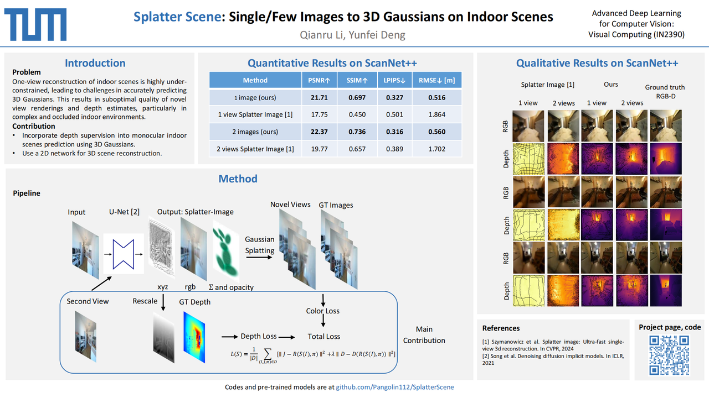

# Splatter Scene



# Installation

First, create a conda environment: 
```
conda create --name splatter-scene
conda activate splatter-scene
```

Install Pytorch following [official instructions](https://pytorch.org). Pytorch / Python combination that was verified to work is:
- Python 3.8, PyTorch 2.1.1, CUDA 12.4

Install other requirements:
```
pip install -r requirements.txt
```

Second, install Gaussian Splatting renderer, i.e. the library for rendering a Gaussian Point cloud to an image. To do so, pull the [Gaussian Splatting repository](https://github.com/graphdeco-inria/gaussian-splatting/tree/main) and, with your conda environment activated, run `pip install submodules/diff-gaussian-rasterization`. You will need to meet the [hardware and software requirements](https://github.com/graphdeco-inria/gaussian-splatting/blob/main/README.md#hardware-requirements). We did all our experimentation on an NVIDIA RTX4090 GPU. 


# Data

## ScanNet++
For training / evaluating on ScanNet++ please download the dataset from [ScanNet++ homepage](https://kaldir.vc.in.tum.de/scannetpp/). Preprocess the file into the format below and change `SCANNETPP_DATASET_ROOT` in `datasets/scannetpp.py` to the parent folder of the dataset folder. For example, if your folder structure is: `/home/user/ScanNet++/scannetpp/scannetpp_train`, in `datasets/scannetpp.py` set  `SCANNETPP_DATASET_ROOT="/home/user/ScanNet++"`. 

```
ScanNet++/
│
├── scannetpp/
│ ├── scannetpp_train/
│ │ ├── scene_name_1/
│ │ │ ├── rgb/
│ │ │ ├── depth/
│ │ │ ├── pose_colmap_depth/
│ │ │ └── intrinsics.txt
│ │ ├── scene_name_2/
│ │ │ ├── rgb/
│ │ │ ├── depth/
│ │ │ ├── pose_colmap_depth/
│ │ │ └── intrinsics.txt
│ │ └── ...
│
│ ├── scannetpp_val/
│ │ ├── scene_name_1/
│ │ │ ├── rgb/
│ │ │ ├── depth/
│ │ │ ├── pose_colmap_depth/
│ │ │ └── intrinsics.txt
│ │ └── ...
│
│ ├── scannetpp_test/
│ │ ├── scene_name_1/
│ │ │ ├── rgb/
│ │ │ ├── depth/
│ │ │ ├── pose_colmap_depth/
│ │ │ └── intrinsics.txt
│ │ └── ...
```

For preprocessing, first undistort and render the depth using colmap following the ScanNet++'s toolbox [ScanNet++ Toolbox repository](https://github.com/scannetpp/scannetpp), then select the scene images that are with similar camera poses and positions, saving them along with their poses and depths following the format above. You can use the tool we provide for saving them in `datasets/rgb_depth_pose_preprocess.py` and `datasets/auto_datasets.py`. Remember to change the paths in the `datasets/base_path.py` to your paths.

# Using this repository

## Pretrained models

Pretrained models training on 35 ScanNet++ scenes are available via [Pretrained Models](https://drive.google.com/drive/folders/1hGTX3XAeV3bd8tpp-CGDJDOdZB9LJrDu?usp=sharing).

## Evaluation

Once you have downloaded and preprocessed the ScanNet++ dataset, evaluation can be run with 
```
python eval.py scannetpp
```

You can also train your own models and evaluate it with 
```
python eval.py scannetpp --experiment_path $experiment_path
```
`$experiment_path` should hold a `model_latest.pth` file and a `.hydra` folder with `config.yaml` inside it.

To evaluate on the validation split, call with option `--split val`.

You can set for how many objects to save renders with option `--save_vis`.
You can set where to save the renders with option `--out_folder`.

## Training

Run the training for ScanNet++ with:
```
python train_network.py +dataset=scannetpp cam_embd=pose_pos
```

To train a 2-view model run:
```
python train_network.py +dataset=scannetpp cam_embd=pose_pos data.input_images=2 opt.imgs_per_obj=5
```

## Code structure

Training loop is implemented in `train_network.py` and evaluation code is in `eval.py`. Datasets are implemented in `datasets/ScanNet++.py`. Model is implemented in `scene/gaussian_predictor.py`. The call to renderer can be found in `gaussian_renderer/__init__.py`.

## Camera conventions

Gaussian rasterizer assumes row-major order of rigid body transform matrices, i.e. that position vectors are row vectors. It also requires cameras in the COLMAP / OpenCV convention, i.e., that x points right, y down, and z away from the camera (forward). Make sure your camera pose is in camera-to-world format.

# Acknowledgements

This work is the extension of **"Szymanowicz et al. Splatter Image: Ultra-Fast Single-View 3D Reconstruction" (CVPR 2024)**, from object-level method to a scene-level method. We thank the authors of the original paper for their code structure implementation.

We thank Barbara Roessle for her insightful help during the project period.
